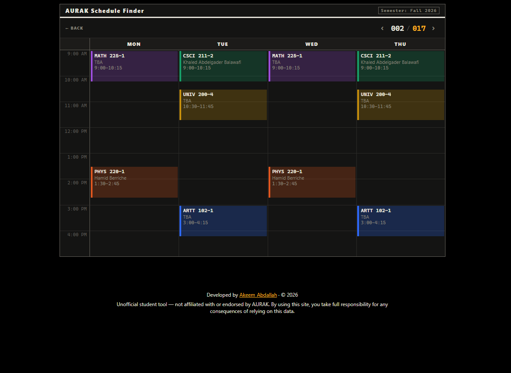

# AURAK Schedule Finder

**Pick your courses. Get every timetable where nothing clashes.**

A schedule generator for students at the American University of Ras Al Khaimah, built for
the one week a year that actually matters — registration. Instead of dragging courses
around a calendar to see what fits, you pick what you want to take and get every valid
combination at once.

🔗 **[aurak-scheduler.com](https://aurak-scheduler.com)**

[](https://react.dev)
[](https://fastapi.tiangolo.com)
[](https://www.postgresql.org)



> [!WARNING]
> **Unofficial student tool — not affiliated with or endorsed by AURAK.** Course data is
> pulled from AURAK's public schedule page and refreshed daily, but it can lag reality.
> Always confirm on the official system before you register. Seat counts are deliberately
> not shown: stale seat data is worse than no seat data.

## What it does

Pick a subject, pick a course, add another row, repeat. If you only want certain sections
of a course — a specific instructor, or nothing at 8am — you can narrow a course down to
just those. Hit generate and it works out every combination where nothing overlaps, then
lets you page through them on a weekly grid.

Courses with no meeting times (senior projects, independent study) are handled properly
rather than multiplying the results by every invisible section.

The course data refreshes itself every morning, so nobody has to remember to update
anything.

## How it's built

| Layer | Stack | Hosted on |
|---|---|---|
| Frontend | React + Vite | Vercel |
| API | FastAPI + SQLAlchemy + Alembic | Render |
| Database | PostgreSQL | Supabase |
| Daily refresh | Python scraper + GitHub Actions cron | GitHub |

```
GitHub Actions (daily cron)
        │
        ▼
fetch_schedule.py ──── scrapes AURAK's public schedule page
        │
        ▼
   PostgreSQL  ◀────── FastAPI  ◀────── React frontend
   (Supabase)          (Render)         (Vercel, static)
                                              │
                                              ▼
                                   schedules generated in-browser
```

The combination search runs **client-side**, not on the server. It's a backtracking
search over bitmask-encoded weekly occupancy — each section's meeting times are packed
into a bitmask, so checking whether two classes collide is a single bitwise AND. Keeping
it in the browser means a hundred students generating schedules at once costs the server
nothing, which matters on a free tier during registration week.

## Running it locally

**Frontend**

```bash
npm install
npm run dev
```

**Backend**

```bash
cd backend
python -m venv venv
venv\Scripts\activate
pip install -r requirements.txt
```

Add a `backend/.env` with your database connection string:

```
DATABASE_URL=postgresql://...
```

Then set up the schema, load real course data, and start the API:

```bash
alembic upgrade head
python fetch_schedule.py
uvicorn app:app --reload
```

Interactive API docs are available at `http://127.0.0.1:8000/docs` once it's running.

Note that the frontend's API URL is currently hardcoded to the deployed backend in
`src/App.jsx` — point it at `http://127.0.0.1:8000/courses` if you want it hitting your
local API instead.
